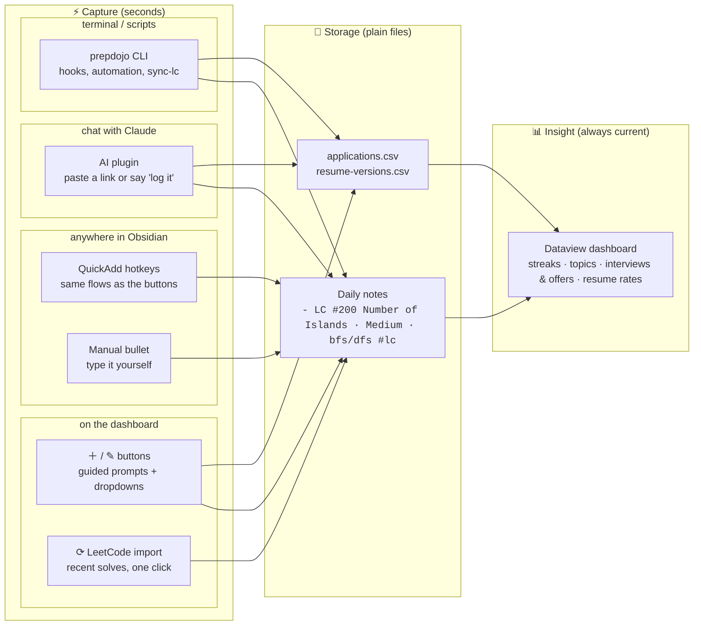
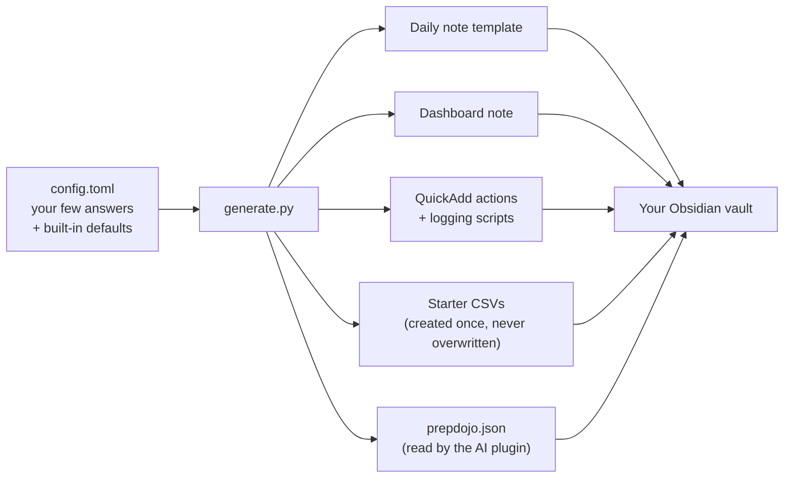

# PrepDojo 🥋

*An interview prep and job application tracker that lives in your Obsidian vault.*

<!-- TODO hero image: the single strongest asset goes here, above the fold.
     Best candidate: a short GIF of the full loop — dashboard button → prompts →
     entry appears → dashboard numbers tick up. Record as docs/media/hero.gif,
     then uncomment:

-->

Job hunting means doing a lot of small things every day. A LeetCode problem at breakfast, some ML review at night, a batch of applications in between. None of it feels like much, and a week later you can't remember any of it. PrepDojo keeps all of it on one dashboard page. You log with a click, or just tell an AI "did two sum today", and the same page shows your streak, which topics need work, how many applications went out this week, and which resume is actually getting you interviews.

Everything lives in plain files in an [Obsidian](https://obsidian.md) vault on your own computer and your records stay readable in any editor.

## ✨ What you can do

⟳ **Import your LeetCode solves with one click.** Just crushed a few problems on LeetCode? Click ⟳ Import on the dashboard and your recent accepted submissions are logged for you.

<!-- TODO gif: ⟳ Import click → notice "2 new, 4 already logged" → Needs topic
     rows → ＋ Topic picker. Save as docs/media/import-lc.gif, embed:

-->

＋ **Log any prep work with one click.** An application fired off, an ML concept reviewed at lunch, a mock interview survived: every kind of prep has its own button. Click, answer a prompt or two, logged.

<!-- TODO gif: dashboard button → QuickAdd prompts (day, name, difficulty, topic)
     → entry appearing in the daily note. Save as docs/media/log-click.gif, embed:

-->

✎ **Track every application to the end.** Heard back? Hit ✎ Update and log the new status in seconds.

<!-- TODO gif: ✎ Update click → fuzzy search "stri" → pick → status HR Call →
     Active table shows the row. Save as docs/media/update-app.gif, embed:

-->

⇄ **A/B test your resume.** Every application you send tests one resume version. The dashboard computes an interview rate per version, so you can see which one actually gets you interviews.

<!-- TODO screenshot: the "By resume version" table with rates.
     Save as docs/media/resume-rates.png -->

▦ **One page shows it all.** Everything above lives on a single dashboard: your current streak, topics ranked from solid to shaky, interviews and offers up top, resume rates below.

<!-- TODO screenshot (the money shot): the dashboard in Reading view showing the
     streak line + by-topic and by-difficulty tables. Save as docs/media/dashboard.png -->

✦ **Or let AI do the logging.** Too tired to click? Toss Claude a LeetCode link or mumble "did two sum today" and the entry writes itself. Applications too: "Stripe moved me to phone screen" updates your tracker.

<!-- TODO screenshot: a Claude chat where a pasted LC link becomes a logged entry.
     Save as docs/media/log-claude.png -->

## 📋 Requirements


- **[Obsidian](https://obsidian.md)**
- **Python 3.9+** for the one-command setup. No Python at all? See [manual setup](docs/manual-setup.md).

Optional: the Claude desktop app (Cowork) or Claude Code, if you want AI logging.

## 🚀 Quick start

**Step 1: Get the repo**

```bash
git clone https://github.com/aaaxy/PrepDojo.git
cd PrepDojo
```

**Step 2: Prepare your vault**

1. Pick the folder that is (or will be) your Obsidian vault. It should live outside this repo.
2. Open that vault in Obsidian at least once.
3. On **Obsidian 1.12+**: open **Settings → General →** enable **Command line interface**.
4. Quit Obsidian (setup reopens it when installing the plugins).

**Step 3: Run setup** with your vault's path, back in the terminal:

```bash
python3 setup.py /path/to/YourVault
```

Setup asks two optional questions along the way: your LeetCode username (powers the import button) and your daily-notes folder. Everything else has sensible defaults you can change later. See [docs/configuration.md](docs/configuration.md).

**Step 3b: skip to Step 4 if your Obsidian is 1.12 (released February 2026) or newer.** On older versions, setup can't install the plugins, so install them by hand:

1. Open **Settings → Community plugins** and turn off **Restricted mode**.
2. Click **Browse**, then install and enable **[Dataview](https://obsidian.md/plugins?id=dataview)**, **[QuickAdd](https://obsidian.md/plugins?id=quickadd)**, and **[Calendar](https://obsidian.md/plugins?id=calendar)**.

**Step 4: Finish in Obsidian**, whichever version you're on:

1. Open **Settings → Community plugins** and open **Dataview**'s settings (the ⚙️ next to it, or the **···** menu on newer versions). Turn on **Enable JavaScript queries**.
2. Open the dashboard note in Reading view and click a button. Done.

The tables start empty. Your first log fills them, and your streak starts counting.

**Step 5 (optional): Add AI logging.** Install once, in Claude Code or the Claude app:

```
/plugin marketplace add aaaxy/PrepDojo
/plugin install prepdojo@prepdojo
```

Your settings travel with your vault (setup writes a small `prepdojo.json` there), so the plugin needs no configuration and keeps working when you change settings.

**That's it. You're all set.** From here on, PrepDojo is just the dashboard and your daily grind.

---

*Everything below is for later: changing settings, regenerating after a change, and updating PrepDojo itself.*

## 🔄 Regenerating and updating

The dashboard, templates, and logging flows are all generated from `config.toml`. The same three steps apply whether you changed a setting or are updating PrepDojo itself:

1. Quit Obsidian.
2. In the repo (after `git pull`, if updating PrepDojo itself), run:

```bash
python3 generate.py /path/to/YourVault
```

The path is remembered in `config.toml`, so a plain `python3 generate.py` works from then on.

3. Restart Obsidian and reopen the dashboard note.

**Reading the output**: `installed` and `up to date` mean done. `PRESERVED ... new version written to *.new` means you've customized that file since it was installed. Compare it with the `.new` copy and merge at your own pace, or rerun with `--force` to take the new version wholesale.

**What it can touch**: generated files you haven't customized. Those update in place.

**What it never touches**: anything you *have* customized (kept as is, with the fresh version written beside it as `.new`) and your data. Daily notes and the application CSVs are never written, under any flag.

> [!NOTE]
> Because your CSVs are never touched, an update can't add a new column to them either. When a release adds one to the application tracker, the release notes will ask you to add that column name to the end of your `applications.csv` header row yourself.

**The AI plugin updates separately**: it updates through Claude's plugin manager, not `generate.py`. After a PrepDojo release, refresh it from the `/plugin` menu in Claude.

## 🔍 System overview

To you, PrepDojo is one dashboard page. Under the hood, that page is built from three layers, all generated from one config file:

- **Capture**: log what you did in seconds, from wherever you are. Four ways into the same log: one-click dashboard buttons with guided prompts, QuickAdd hotkeys running the same flows from anywhere in Obsidian, an AI plugin for Claude, and a CLI (`prepdojo.py`) for terminals and automation. The AI plugin turns "just did two sum" or a pasted LeetCode URL into a correctly formatted entry. Its skills read plain `prepdojo.json`, so any LLM agent can follow the same contract. A fifth way is automatic: the ⟳ LeetCode import fetches your recent accepted submissions. Every entry point validates entries, so the log can't drift into inconsistency
- **Storage**: where your record lives. Plain text files on your own machine: markdown bullets in your daily notes for practice, CSV rows for job applications. Human-readable, grep-able, no database, no lock-in. Every tool in this repo is replaceable, and your record outlives all of them
- **Insight**: how you see your progress. One dashboard note computes it all from your record: streaks, per-topic and per-difficulty breakdowns with date-range filters, a "needs re-review" list, and application stats (active interviews, offers, milestone summary, interview rate per resume version), updating live while the note is open. It stores nothing itself, so regenerating, moving, or customizing it is always safe

Daily workflow, from a solved problem to insight:



One-time setup, everything personalized from a single file:




## 📜 License

[PolyForm Noncommercial 1.0.0](LICENSE): free to use, modify, and share for any noncommercial purpose (personal use, education, research, nonprofits). Commercial use requires a separate license from the author.

Copyright (c) 2026 [aaaxy](https://github.com/aaaxy)
