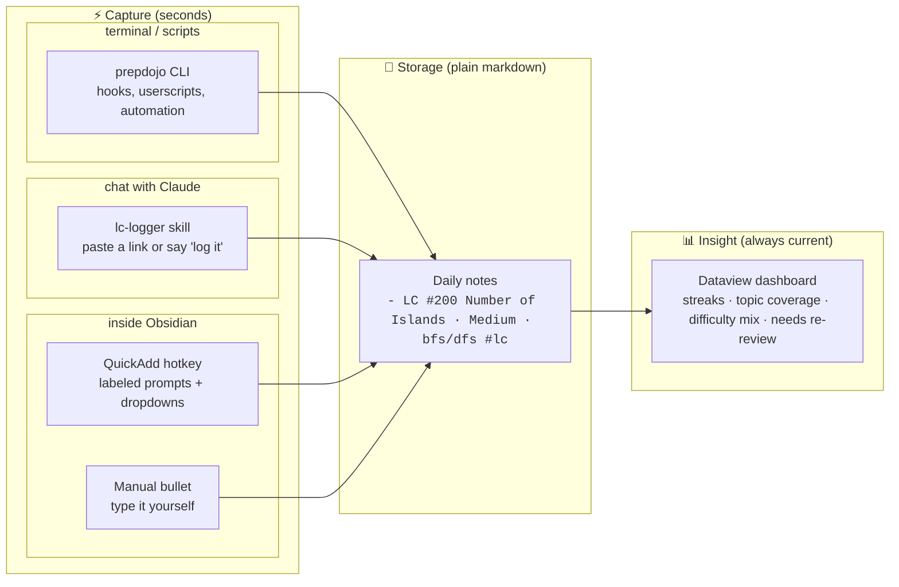
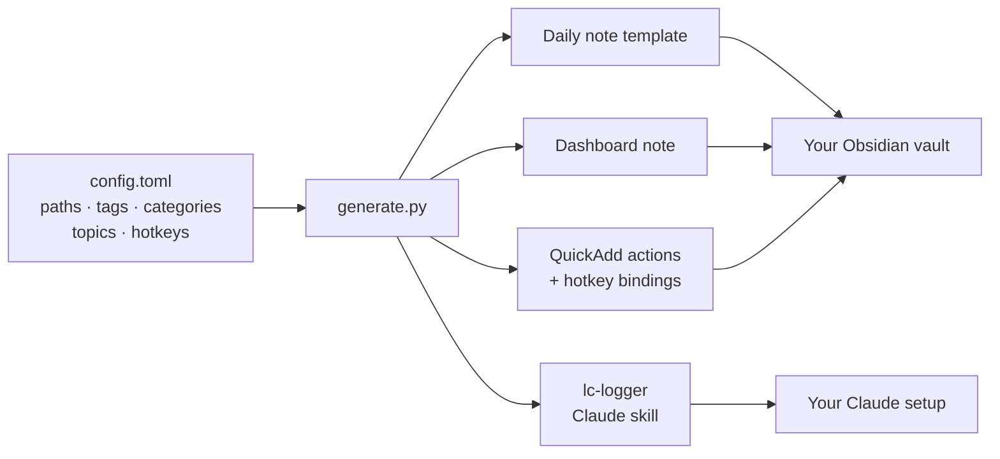

# PrepDojo 🥋

*Show up daily. Log in seconds. Leave sharper.*

PrepDojo is a **daily-practice tracking system** built on [Obsidian](https://obsidian.md). One hotkey or a pasted LeetCode link is a complete log entry; one note is your whole picture, with streaks, topic and difficulty breakdowns, and a "needs re-review" list, always current.

It ships as three coordinated layers, all generated from one config file:

- **Capture** — instant logging from anywhere: QuickAdd hotkey actions with dropdown prompts inside Obsidian, an AI logging skill (built for Claude, portable to any LLM agent) that turns "just did two sum" or a pasted LeetCode URL into a correctly formatted entry, or a CLI (`prepdojo.py`) that makes logging scriptable from any terminal, hook, or automation
- **Storage** — entries are plain markdown bullets in your daily notes: human-readable, grep-able, no database, no lock-in
- **Insight** — a live Dataview dashboard computing streaks, per-topic and per-difficulty breakdowns, and a "needs re-review" list

The default configuration tracks ML engineer interview prep (LeetCode, ML fundamentals, ML coding, system design, behavioral), but nothing is hardcoded: categories, tags, topic taxonomies, folder layout, hotkeys, and formats all live in `config.toml`, and `generate.py` rebuilds every layer — Obsidian configs, QuickAdd actions, dashboard, and the AI skill — to match. Rename the categories and the same machinery tracks language learning, fitness, or any daily practice.

## System overview

Daily workflow, from a solved problem to insight:



One-time setup, everything personalized from a single file:



## How it works

Every entry is one plain bullet in a daily note, ending with a category tag:

```
## Interview Prep

- LC #200 Number of Islands · Medium · bfs/dfs #lc
- bias-variance tradeoff · 🟢 #mlfund
- design a feed ranking system #mlsys
```

That's the entire data model. Three tools write and read these lines:

1. **QuickAdd (Obsidian plugin)**: press a hotkey anywhere in Obsidian, pick a day ("today", "yesterday", "last friday"), fill labeled prompts with dropdowns for difficulty and topic. No typos, no format drift.
2. **Claude skill** (optional): paste a LeetCode URL into a Claude (Cowork/Claude Code) session with vault access and it identifies the problem, asks which approach you used, and writes the entry.
3. **Dashboard (Dataview)**: a single note that renders stats, streaks, and per-category tables from all daily notes. Open it; it is always current.

## Requirements

- Obsidian with community plugins: [Calendar](https://obsidian.md/plugins?id=calendar), [Dataview](https://obsidian.md/plugins?id=dataview) (enable "JavaScript queries" in its settings), [QuickAdd](https://obsidian.md/plugins?id=quickadd)
- Python 3.11+ to run the generator (or follow [manual setup](docs/manual-setup.md))
- Optional: Claude desktop app (Cowork) or Claude Code for the logging skill

## Quick start

The defaults work out of the box. You only need to tell PrepDojo where things live in your vault.

**1. Check three settings** in the `[vault]` section of `config.toml`:

| Setting | What it is | Default |
|---|---|---|
| `daily_notes_folder` | where your daily notes live | `Calendar/Daily Notes` |
| `daily_note_template` | where the daily note template goes | `Templates/Daily Note.md` |
| `dashboard_path` | where the dashboard note goes | `Interview Prep Dashboard.md` |

Already using daily notes? Set `daily_notes_folder` to your existing folder. New vault? Keep the defaults. Everything else in the file (tags, hotkeys, topics) has sensible defaults you can revisit later; see [Configuration](#configuration).

**2. Generate and install:**

```bash
python3 generate.py --install /path/to/YourVault
```

Installs are edit-safe: files you've modified are never overwritten (the fresh version lands next to them as `*.new.md`; details in [Changing your configuration later](#changing-your-configuration-later)).

**3. Restart Obsidian**, then two clicks of wiring: enable **JavaScript queries** in Dataview's settings, and assign hotkeys under Settings → Hotkeys → search "QuickAdd" (suggested: `Cmd/Ctrl+Shift+L` for LeetCode).

**4. Try it.** Press the hotkey, log a problem for "today", and open the dashboard note in Reading view. You should see the entry in the tables and a one-day streak.

<details>
<summary>Installing by hand instead (or if you already use QuickAdd)</summary>

Run `python3 generate.py` without `--install`, then copy from `dist/`:

| File in `dist/` | Where it goes |
|---|---|
| `vault/<your template path>` | same path inside your vault |
| `vault/<your dashboard path>` | same path inside your vault |
| `obsidian/daily-notes.json` | `<vault>/.obsidian/daily-notes.json` |
| `obsidian/plugins/quickadd/data.json` | `<vault>/.obsidian/plugins/quickadd/data.json` |
| `obsidian/hotkeys-snippet.json` | merge into `<vault>/.obsidian/hotkeys.json` |
| `claude-skill/lc-logger.skill` | install in Claude (see [Logging](#logging)) |

**Warning**: the generated QuickAdd `data.json` replaces that plugin's existing configuration. If you already use QuickAdd for other things, don't copy the file; recreate the capture choices manually following [docs/manual-setup.md](docs/manual-setup.md).

</details>

## Configuration

All configuration lives in `config.toml`, grouped by how likely you are to touch it:

| Group | Settings | When you'd change it |
|---|---|---|
| `[vault]` | `daily_notes_folder`, `daily_note_template`, `dashboard_path`, `date_format`, `prep_heading` | day one, to match your vault layout |
| `[categories.*]` | `name`, `tag`, `hotkey` per category | to rename categories, change tags, or add hotkeys; rename all five and the same system tracks any daily practice |
| `[leetcode]` | `topics`, `difficulties` | to adjust the topic taxonomy the dropdowns and dashboard grouping use |

After any change, rerun `python3 generate.py --install /path/to/YourVault` (see [Changing your configuration later](#changing-your-configuration-later)).

## Logging

- In Obsidian: hotkey (default `Cmd/Ctrl+Shift+L` for LeetCode, `Cmd/Ctrl+Shift+M` for ML fundamentals) → pick day → answer prompts. The other three categories get QuickAdd choices too; assign hotkeys in `config.toml` or via Settings → Hotkeys.
- With Claude: install `dist/claude-skill/lc-logger.skill`, connect your vault folder to the session, then paste a problem link or say "did 239 yesterday, solved with dp".
- With other LLMs: the skill is plain markdown with every convention spelled out, so it doubles as a ready-made system prompt for any agent that can read and write files in your vault (a custom GPT, Cursor rules, a Gemini CLI context file, an `AGENTS.md`). Copy the contents of `dist/claude-skill/lc-logger/SKILL.md` into your agent's instructions; only the packaging and the clickable question dialog are Claude-specific, and the latter degrades gracefully to a plain-text question.
- From a terminal or script: the CLI validates against your taxonomy and writes to the right daily note (Obsidian doesn't need to be running):

  ```bash
  export PREPDOJO_VAULT=/path/to/YourVault   # or set `path` under [vault] in config.toml
  python3 prepdojo.py log lc "#200 Number of Islands" -d medium -t bfs/dfs
  python3 prepdojo.py log lc "#322 Coin Change" -d M -t dp --note "needed hints" --date yesterday
  python3 prepdojo.py log mlfund "batch norm" --conf yellow
  python3 prepdojo.py streak      # streak + per-category counts, no Obsidian needed
  ```

  Because it's a single validated entry point, anything that can run a shell command becomes a capture surface: a Raycast/Alfred snippet, a git hook, a browser userscript on LeetCode's "Accepted" page.
- By hand: type the bullet yourself. Unchecked checkboxes (`- [ ]`) are treated as placeholders and ignored by the dashboard; plain bullets and checked tasks count.

## Conventions worth knowing

- Topics are lowercase and come from the taxonomy in `config.toml`. Consistency is what makes the by-topic table useful.
- Finer divisions use `main - subtopic` (e.g. `dp - knapsack`); the dashboard groups them under `main` and shows the full string in the problem table.
- A short note can ride on the entry as a fourth segment (`... · dp · needed hints #lc`) and appears in the dashboard's Notes column. Longer notes go as indented sub-bullets under the entry; the dashboard ignores them on purpose.
- Difficulty accepts `Easy/Medium/Hard`, `E/M/H`, or 🟢/🟡/🔴; the dashboard normalizes all of them.

## Changing your configuration later

Generation is a build step, not a one-time event. When you edit `config.toml` (new topic, renamed category, different hotkey), rerun:

```bash
python3 generate.py --install /path/to/YourVault
```

and restart Obsidian. Three things to know:

1. Customize in the repo's `templates/`, not in the installed vault copies; treat the vault files as build outputs. If you do edit a vault copy, the checksum manifest protects it (see above), and you merge from the `*.new.md` file at your own pace.
2. Regenerate the QuickAdd config while Obsidian is closed. The plugin holds settings in memory and can write the old version back over your new file when it quits.
3. Config changes affect future entries only. If you rename a tag (say `lc` to `leetcode`), old entries still carry the old tag and will drop off the dashboard until you find-and-replace them in your daily notes.

## Repository layout

```
config.toml          all user configuration
generate.py          renders templates + builds plugin configs from config.toml
prepdojo.py          CLI: log entries and check streaks from any terminal or script
templates/
  vault/             daily note template and dashboard (with placeholders)
  skill/             Claude skill (with placeholders)
docs/manual-setup.md fully manual, no-Python setup walkthrough
dist/                generated output (gitignored)
```

## License

[PolyForm Noncommercial 1.0.0](LICENSE): free to use, modify, and share for any noncommercial purpose (personal use, education, research, nonprofits). Commercial use requires a separate license from the author.

Copyright (c) 2026 [aaaxy](https://github.com/aaaxy)
