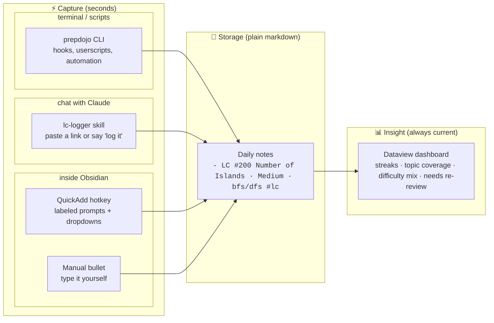
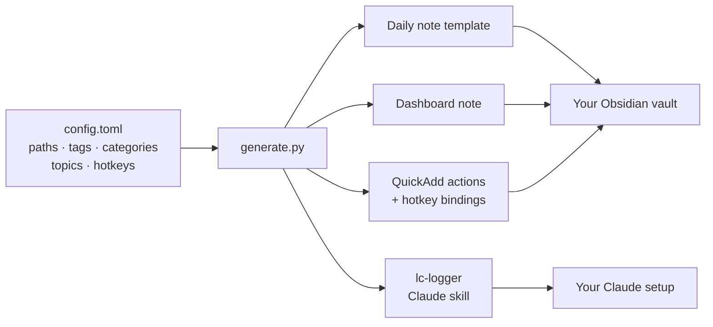

# PrepDojo 🥋

*Show up daily. Log in a click. Leave sharper.*

<!-- TODO hero image: the single strongest asset goes here, above the fold.
     Best candidate: a short GIF of the full loop — dashboard button → prompts →
     entry appears → dashboard numbers tick up. Record as docs/media/hero.gif,
     then uncomment:

-->

Job hunting is a hundred small efforts a day: a LeetCode problem at breakfast, ML review at night, a batch of applications in between. Each one is forgettable — together, they're your entire preparation. PrepDojo makes sure none of it disappears, and everything happens on one dashboard page. Log anything with a single click (or just tell an AI "did two sum today"), and the same page shows the full picture the moment you need it: your streak, which topics are solid and which are shaky, how many applications went out this week, and which resume actually gets you interviews.

Everything stays in plain files on your own computer — no account, no subscription, nothing to lose access to. Built on [Obsidian](https://obsidian.md), free and local-first.

## What you can do

🧩 **Import your LeetCode solves with one click.** Just crushed a few problems on LeetCode? Click ⟳ Import on the dashboard and your recent accepted submissions land in your daily notes.

<!-- TODO gif: ⟳ Import click → notice "2 new, 4 already logged" → Needs topic
     rows → ＋ Topic picker. Save as docs/media/import-lc.gif, embed:

-->

⚡ **Log any prep work with one click.** An application fired off, an ML concept reviewed at lunch, a mock interview survived: every kind of prep has its own button. Click, answer a prompt or two, logged.

<!-- TODO gif: dashboard button → QuickAdd prompts (day, name, difficulty, topic)
     → entry appearing in the daily note. Save as docs/media/log-click.gif, embed:

-->

📮 **Track every application to the end.** Heard back? Hit ✎ Update and log the new status in seconds. Interviews and offers rise to the top.

<!-- TODO gif: ✎ Update click → fuzzy search "stri" → pick → status HR Call →
     Active table shows the row. Save as docs/media/update-app.gif, embed:

-->

📄 **A/B test your resume.** Stop guessing which resume works. Every application you send is quietly running an experiment. See the results.

<!-- TODO screenshot: the "By resume version" table with rates.
     Save as docs/media/resume-rates.png -->

📊 **One page shows it all.** Everything above lives on a single dashboard: your streak burning, topics ranked from solid to shaky, interviews and offers up top, resume rates below. Open it and today's story is already written. No assembly required.

<!-- TODO screenshot (the money shot): the dashboard in Reading view showing the
     streak line + by-topic and by-difficulty tables. Save as docs/media/dashboard.png -->

🤖 **Or let AI do the logging.** Too tired to click? Toss Claude a LeetCode link or mumble "did two sum today" and the entry writes itself.

<!-- TODO screenshot: a Claude chat where a pasted LC link becomes a logged entry.
     Save as docs/media/log-claude.png -->

## Requirements


- **[Obsidian](https://obsidian.md)**
- **Python 3.9+** for the one-command setup. No Python at all? See [manual setup](docs/manual-setup.md).

Optional: the Claude desktop app (Cowork) or Claude Code, if you want AI logging.

## Quick start

Get the repo:

```bash
git clone https://github.com/aaaxy/PrepDojo.git
cd PrepDojo
```

Prepare your vault:

1. Pick the folder that is (or will be) your Obsidian vault. It should live outside this repo.
2. Open that vault in Obsidian at least once.
3. On **Obsidian 1.12+**: open **Settings → General →** enable **Command line interface**.

Back in the terminal, run setup with your vault's path:

```bash
python3 setup.py /path/to/YourVault
```

Only if you're on **Obsidian older than 1.12** (setup can't install the plugins without the CLI):

1. Open **Settings → Community plugins** and turn off **Restricted mode**.
2. Click **Browse**, then install and enable **[Dataview](https://obsidian.md/plugins?id=dataview)**, **[QuickAdd](https://obsidian.md/plugins?id=quickadd)**, and **[Calendar](https://obsidian.md/plugins?id=calendar)**.

Finish in Obsidian, whichever version you're on:

1. Open **Settings → Community plugins**, click the ⚙️ next to **Dataview**, and turn on **Enable JavaScript queries**.
2. Open the dashboard note in Reading view and click a button. Done.

Tables start empty and fill in as you log — that's normal, not a broken setup.

Setup asks two optional questions along the way — your LeetCode username (powers the import button) and your daily-notes folder. Everything else has sensible defaults you can change later; see [Configuration](#configuration).


## Configuration

Setup asks for everything it needs, so most people never open a config file. The answers live in `config.toml` in the repo, which stays deliberately small:

| Setting | What it controls |
|---|---|
| `[vault] path` | your vault's location (recorded by setup) |
| `[vault] daily_notes_folder` | where entries are logged; match this to your existing daily notes |
| `[vault] date_format` | daily-note filename format; match your Obsidian daily-note setting |
| `[vault] dashboard_path` | where the dashboard note is generated |
| `[leetcode] username` | unlocks the ⟳ Import button and `prepdojo sync-lc` |

Everything else — category names and tags, the topic taxonomy, hotkeys, the applications folder — has a sensible default you can override by adding the setting to `config.toml`. The full list with defaults: [docs/configuration.md](docs/configuration.md). Renaming the five categories there retargets the whole system to any daily practice.

After any change: quit Obsidian, rerun `python3 generate.py`, restart Obsidian (details in [Updating](#updating)).


## Updating

The same short ritual covers both kinds of update — pulling a new PrepDojo version, or changing your own `config.toml` / templates:

1. **Quit Obsidian.** QuickAdd keeps its settings in memory and writes them back on exit; deploying while it runs can silently undo the update.
2. If updating PrepDojo itself: `git pull`.
3. **Deploy:** `python3 generate.py` (it installs into the vault recorded in your config; pass `--install /path/to/AnotherVault` to target a different one).
4. **Read the output.** `installed` and `up to date` mean done. `PRESERVED ... new version written to *.new` means you've hand-edited that file since it was installed — compare it with the `.new` copy and merge at your own pace, or rerun with `--force` to take the new version wholesale.
5. **Restart Obsidian.** Config files are read at launch, so this is what makes the update live.
6. Two things never update automatically:
   - **Hotkeys** — Obsidian's `hotkeys.json` is shared with everything else, so PrepDojo never writes it. If the update added new QuickAdd choices, bind them in Settings → Hotkeys (or merge `dist/obsidian/hotkeys-snippet.json`).
   - **The Claude skill** — it lives in your Claude profile, not the vault. If the update changed it, re-install `dist/claude-skill/lc-logger.skill`.

What an update can and cannot touch, as a rule: generated files that you haven't edited (dashboard, daily-note template, QuickAdd config, logging script) update in place; anything you *have* edited is preserved with a `.new` beside it; your data — daily notes and application CSVs — is never written by the installer, under any flag.

Three habits that keep updates smooth:

1. Customize in the repo's `templates/`, not in the installed vault copies; treat vault files as build outputs. QuickAdd's config is special: it's merged, not replaced — PrepDojo updates only its own choices (matched by ID) and leaves the plugin's settings and any choices you created yourself untouched. The flip side: edits you make to *PrepDojo's* choices in QuickAdd's settings UI are overwritten on the next deploy, so change those via `config.toml` instead.
2. Config changes affect future entries only. If you rename a tag (say `lc` to `leetcode`), old entries still carry the old tag and drop off the dashboard until you find-and-replace them in your daily notes.
3. After any update that touches the dashboard, reopen the dashboard note once — the running code in an open tab is the old version until the note re-renders.


## System overview

Under the hood, three coordinated layers, all generated from one config file:

- **Capture** — log what you did in seconds, from wherever you are. Three doors into the same log: QuickAdd hotkey actions with dropdown prompts inside Obsidian, an AI logging skill (built for Claude, portable to any LLM agent) that turns "just did two sum" or a pasted LeetCode URL into a correctly formatted entry, and a CLI (`prepdojo.py`) that makes logging scriptable from any terminal, hook, or automation. Every door validates entries, so the log can't drift into inconsistency
- **Storage** — where your record lives. Plain text files on your own machine: markdown bullets in your daily notes for practice, CSV rows for job applications. Human-readable, grep-able, no database, no lock-in — every tool in this repo is replaceable, and your record outlives all of them
- **Insight** — how you see your progress. One dashboard note computes it all from your record: streaks, per-topic and per-difficulty breakdowns, a "needs re-review" list, and application stats (daily counts, pipeline, interview rate per resume version), updating live while the note is open. It stores nothing itself, so regenerating, moving, or customizing it is always safe

Daily workflow, from a solved problem to insight:



One-time setup, everything personalized from a single file:




## Repository layout

```
config-template.toml tracked defaults; copy to config.toml (gitignored) and edit that
setup.py             one-command first-time setup: config + install + plugin install
generate.py          renders templates + builds plugin configs from config.toml
prepdojo.py          CLI: log entries and check streaks from any terminal or script
templates/
  vault/             daily note template and dashboard (with placeholders)
  skill/             Claude skill (with placeholders)
docs/manual-setup.md fully manual, no-Python setup walkthrough
.githooks/pre-commit blocks commits that contain a personal absolute path
dist/                generated output (gitignored)
config.toml          your personal config (gitignored, created from the template)
```

## License

[PolyForm Noncommercial 1.0.0](LICENSE): free to use, modify, and share for any noncommercial purpose (personal use, education, research, nonprofits). Commercial use requires a separate license from the author.

Copyright (c) 2026 [aaaxy](https://github.com/aaaxy)
