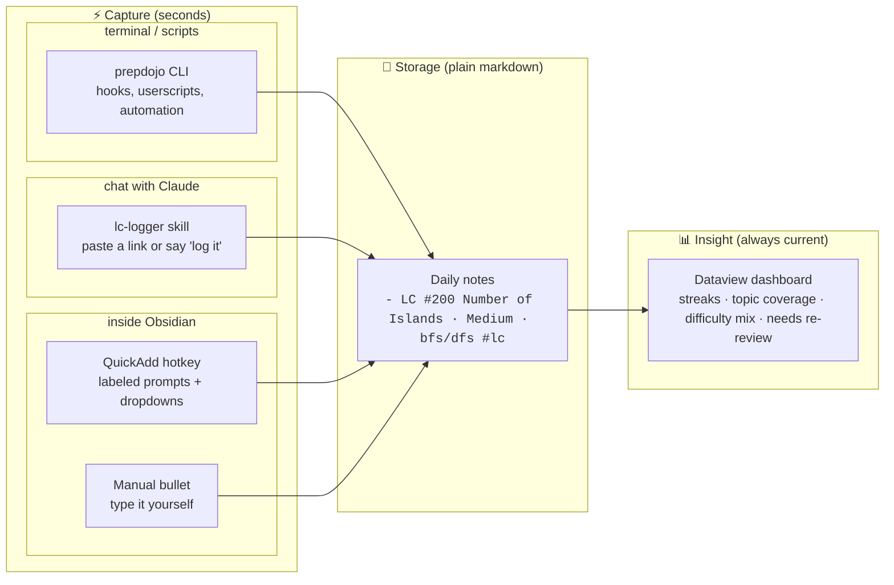
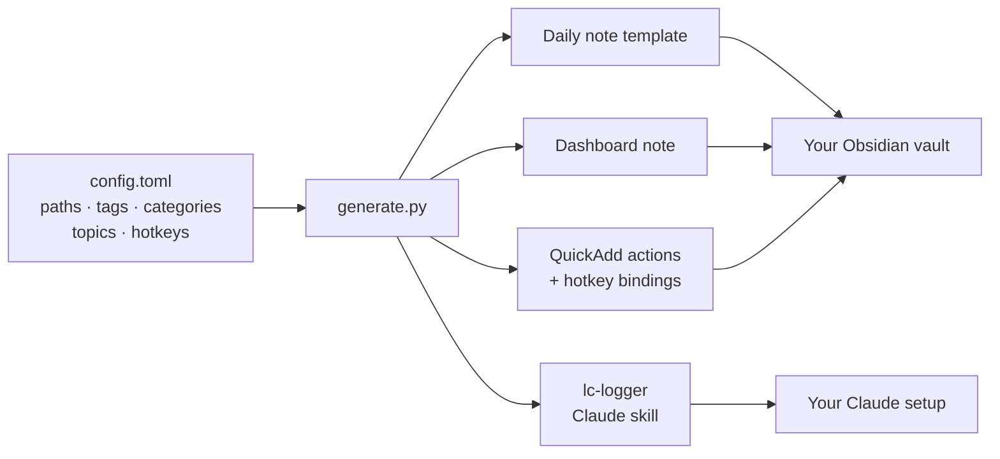

# PrepDojo 🥋

*Show up daily. Log in seconds. Leave sharper.*

<!-- TODO hero image: the single strongest asset goes here, above the fold.
     Best candidate: a short GIF of the full loop — hotkey → prompts → entry
     appears → dashboard numbers tick up. Reuse docs/media/log-hotkey.gif or
     record a dedicated docs/media/hero.gif, then uncomment:

-->

Job hunting is a hundred small efforts a day: a LeetCode problem at breakfast, ML review at night, a batch of applications in between. Each one is forgettable — together, they're your entire preparation. PrepDojo makes sure none of it disappears. Log anything in seconds (one keyboard shortcut, or just tell an AI "did two sum today"), and open one page for the full picture whenever you need it: your streak, which topics are solid and which are shaky, how many applications went out this week, and which resume actually gets you interviews.

Everything stays in plain files on your own computer — no account, no subscription, nothing to lose access to. Built on [Obsidian](https://obsidian.md), free and local-first.

## What you can do

**Log a problem in two keystrokes.** Press a hotkey anywhere in Obsidian, pick the day and topic from dropdowns, done — the entry lands in the right daily note, correctly formatted, every time.

<!-- TODO gif: hotkey → QuickAdd prompts (day, name, difficulty, topic) → entry
     appearing in the daily note. Save as docs/media/log-hotkey.gif, embed:

-->

**Or just tell the AI.** Paste a LeetCode link into Claude, or say "did two sum today" — it identifies the problem, asks which approach you used, and writes the entry for you. "Log this for yesterday" works too.

<!-- TODO screenshot: a Claude chat where a pasted LC link becomes a logged entry.
     Save as docs/media/log-claude.png -->

**Open one page, see everything.** Your streak, problems by topic and by difficulty, ML topics flagged for re-review, and this week's application count — always current the moment you open it.

<!-- TODO screenshot (the money shot): the dashboard in Reading view showing the
     streak line + by-topic and by-difficulty tables. Save as docs/media/dashboard.png -->

**Know which resume actually works.** Log each application with the resume version you used, and the dashboard computes interview rates per version — you're A/B testing your own resume with real data instead of guessing.

<!-- TODO screenshot: the "By resume version" table with rates.
     Save as docs/media/resume-rates.png -->

> [!TIP]
> **Not just interview prep.** The default setup tracks ML engineer interview prep (LeetCode, ML fundamentals, ML coding, system design, behavioral), but nothing is hardcoded — categories, tags, topics, folders, and hotkeys all live in `config.toml`, and everything is rebuilt from it. Rename the categories and the same machinery tracks language learning, fitness, or any daily practice.


## Requirements

Two things on your machine, and you're ready:

- **Obsidian** — ideally 1.12+, so setup can auto-install the three community plugins PrepDojo runs on ([Dataview](https://obsidian.md/plugins?id=dataview), [QuickAdd](https://obsidian.md/plugins?id=quickadd), [Calendar](https://obsidian.md/plugins?id=calendar)). Older versions work too; you add those three yourself in a few clicks ([how](#obsidian-older-than-112)).
- **Python 3.9+** for the one-command setup. No Python at all? See [manual setup](docs/manual-setup.md).

Optional: the Claude desktop app (Cowork) or Claude Code, if you want AI logging.

## Quick start

The defaults work out of the box; you mostly just tell PrepDojo where your vault is. Two ways: one command, or the same steps by hand.

### Fastest: one command (Obsidian 1.12+)

```bash
python3 setup.py
```

It creates your `config.toml`, opens it in your editor, and waits. Paste your vault's location into the marked line (drag the folder into the editor to get the path — no typing), save, press Enter back in the terminal, and it finishes everything: vault files (dashboard, daily-note template, QuickAdd config), and — on **Obsidian 1.12+** with its CLI enabled — the three plugins, installed and enabled. It ends by printing the few GUI-only steps that remain. If the `obsidian` command isn't available (older Obsidian, or the CLI not enabled yet), it does everything else and tells you how to add the plugins by hand.

(Prefer flags? `python3 setup.py /path/to/YourVault` skips the editor pause.)

To get the automatic plugin install, two one-time things first: enable Obsidian's CLI (Settings → General → Command line interface → register it), and open your target vault in Obsidian at least once. The CLI installs plugins into whichever vault Obsidian has open, so `setup.py` checks that it matches your target and safely skips the plugin step (with instructions) if a different vault is open. Then finish the GUI-only bits the script lists at the end — enable Dataview's **JavaScript queries** and assign **QuickAdd hotkeys** — and you're done.

#### Obsidian older than 1.12

Everything works the same except the plugin install (older Obsidian has no CLI for setup to use). Run `python3 setup.py` as above; when it notes the `obsidian` command is missing, add the three plugins yourself:

1. Settings → Community plugins → turn off Restricted mode
2. Browse → install and enable **Dataview**, **QuickAdd**, and **Calendar**
3. Continue with the GUI steps setup printed (JavaScript queries, hotkeys)

### Or set it up step by step

Want to see each part, already use QuickAdd, or on Obsidian older than 1.12? Do the same thing by hand:

**1. Make your own config.** Copy the template to `config.toml` and edit that file (leaving `config-template.toml` untouched as a clean reference you can always fall back to):

```bash
cp config-template.toml config.toml
```

Then check three settings in the `[vault]` section of `config.toml`:

| Setting | What it is | Default |
|---|---|---|
| `daily_notes_folder` | where your daily notes live | `Calendar/Daily Notes` |
| `daily_note_template` | where the daily note template goes | `Templates/Daily Note.md` |
| `dashboard_path` | where the dashboard note goes | `Interview Prep Dashboard.md` |

Already using daily notes? Set `daily_notes_folder` to your existing folder. New vault? Keep the defaults. Everything else in the file (tags, hotkeys, topics) has sensible defaults you can revisit later; see [Configuration](#configuration).

**2. Install the three Obsidian plugins.** PrepDojo needs [Dataview](https://obsidian.md/plugins?id=dataview) (the dashboard engine), [QuickAdd](https://obsidian.md/plugins?id=quickadd) (hotkey logging), and [Calendar](https://obsidian.md/plugins?id=calendar) (click a date to open its note). On **Obsidian 1.12 or newer**, install all three from the terminal:

```bash
# one-time: in Obsidian, Settings → General → Command line interface → register it to your PATH
obsidian plugins:restrict off
obsidian plugin:install id=dataview enable
obsidian plugin:install id=quickadd enable
obsidian plugin:install id=calendar enable
```

What this changes in your vault, so there are no surprises: it turns **Restricted Mode off** (this is what allows community plugins to run their code — required for any of them to work) and both installs **and enables** the three plugins. One related setting is left for you to flip in step 4: Dataview's **JavaScript queries**.

> **On Obsidian older than 1.12?** There's no CLI, so install the three plugins the usual way — Settings → Community plugins → Browse — or follow the [manual setup](docs/manual-setup.md) walkthrough, then carry on with the next step.

**3. Generate and install.** Quit Obsidian first (step 2 opened it), so QuickAdd doesn't write its in-memory config back over the files this step installs:

```bash
python3 generate.py
```

The first run creates your personal `config.toml` from the template; set `path` under `[vault]` in it to your vault's location, then rerun — it builds everything and installs it into the vault in one step (or pass `--install /path/to/YourVault` to override). Installs are edit-safe: files you've modified are never overwritten (the fresh version lands next to them as `*.new.md`; details in [Updating](#updating)), and your data — daily notes, application CSVs — is never touched.

**4. Restart Obsidian**, then two clicks of wiring: enable **JavaScript queries** in Dataview's settings, and assign hotkeys under Settings → Hotkeys → search "QuickAdd" (suggested: `Cmd/Ctrl+Shift+L` for LeetCode).

**5. Try it.** Press the hotkey, log a problem for "today", and open the dashboard note in Reading view. You should see the entry in the tables and a one-day streak. (Before you log anything the dashboard is empty — blank tables are expected, not a broken setup; they fill in as you log.)

<details>
<summary>Installing by hand (Python older than 3.11 without tomli, or if you already use QuickAdd)</summary>

Run `python3 generate.py --no-install` (builds `dist/` without touching the vault), then copy from `dist/`:

| File in `dist/` | Where it goes |
|---|---|
| `vault/<your template path>` | same path inside your vault |
| `vault/<your dashboard path>` | same path inside your vault |
| `obsidian/daily-notes.json` | `<vault>/.obsidian/daily-notes.json` |
| `obsidian/plugins/quickadd/data.json` | `<vault>/.obsidian/plugins/quickadd/data.json` |
| `obsidian/hotkeys-snippet.json` | merge into `<vault>/.obsidian/hotkeys.json` |
| `claude-skill/lc-logger.skill` | install in Claude (see [Logging](#logging)) |

**Warning**: the generated QuickAdd `data.json` replaces that plugin's existing configuration. If you already use QuickAdd for other things, don't copy the file; recreate the capture choices manually following [docs/manual-setup.md](docs/manual-setup.md).

</details>

## How it works

Every entry is one plain bullet in a daily note, ending with a category tag:

```
## Interview Prep

- LC #200 Number of Islands · Medium · bfs/dfs #lc
- bias-variance tradeoff · 🟢 #mlfund
- design a feed ranking system #mlsys
```

That's the entire data model. Three tools write and read these lines:

1. **QuickAdd (Obsidian plugin)**: press a hotkey anywhere in Obsidian, pick a day ("today", "yesterday", "last friday"), fill labeled prompts with dropdowns for difficulty and topic. No typos, no format drift.
2. **Claude skill** (optional): paste a LeetCode URL into a Claude (Cowork/Claude Code) session with vault access and it identifies the problem, asks which approach you used, and writes the entry.
3. **Dashboard (Dataview)**: a single note that renders stats, streaks, and per-category tables from all daily notes. Open it; it is always current.

## System overview

Under the hood, three coordinated layers, all generated from one config file:

- **Capture** — log what you did in seconds, from wherever you are. Three doors into the same log: QuickAdd hotkey actions with dropdown prompts inside Obsidian, an AI logging skill (built for Claude, portable to any LLM agent) that turns "just did two sum" or a pasted LeetCode URL into a correctly formatted entry, and a CLI (`prepdojo.py`) that makes logging scriptable from any terminal, hook, or automation. Every door validates entries, so the log can't drift into inconsistency
- **Storage** — where your record lives. Plain text files on your own machine: markdown bullets in your daily notes for practice, CSV rows for job applications. Human-readable, grep-able, no database, no lock-in — every tool in this repo is replaceable, and your record outlives all of them
- **Insight** — how you see your progress. One dashboard note computes it all from your record: streaks, per-topic and per-difficulty breakdowns, a "needs re-review" list, and application stats (daily counts, pipeline, interview rate per resume version), updating live while the note is open. It stores nothing itself, so regenerating, moving, or customizing it is always safe

Daily workflow, from a solved problem to insight:



One-time setup, everything personalized from a single file:



## Configuration

All configuration lives in `config.toml` (your personal copy of `config-template.toml`), grouped by how likely you are to touch it:

| Group | Settings | When you'd change it |
|---|---|---|
| `[vault]` | `daily_notes_folder`, `daily_note_template`, `dashboard_path`, `date_format`, `prep_heading` | day one, to match your vault layout |
| `[categories.*]` | `name`, `tag`, `hotkey` per category | to rename categories, change tags, or add hotkeys; rename all five and the same system tracks any daily practice |
| `[leetcode]` | `topics`, `difficulties` | to adjust the topic taxonomy the dropdowns and dashboard grouping use |
| `[applications]` | `folder` | where the job-application CSVs live in the vault; the installer creates empty starters there (never overwriting existing data) and the dashboard's Job Applications section reads them |

After any change, rerun `python3 generate.py` (see [Updating](#updating)).

## Logging

- In Obsidian: hotkey (default `Cmd/Ctrl+Shift+L` for LeetCode, `Cmd/Ctrl+Shift+M` for ML fundamentals) → pick day → answer prompts. The other three categories get QuickAdd choices too; assign hotkeys in `config.toml` or via Settings → Hotkeys.
- Applications, also by hotkey: `Cmd/Ctrl+Shift+A` (configurable) opens a short prompt flow — company, position, resume version picked from your catalog, status — and appends a properly formatted row to `applications.csv`. No terminal, no AI, no CSV editing; the dashboard picks it up within seconds.
- With Claude: install `dist/claude-skill/lc-logger.skill`, connect your vault folder to the session, then paste a problem link or say "did 239 yesterday, solved with dp".
- With other LLMs: the skill is plain markdown with every convention spelled out, so it doubles as a ready-made system prompt for any agent that can read and write files in your vault (a custom GPT, Cursor rules, a Gemini CLI context file, an `AGENTS.md`). Copy the contents of `dist/claude-skill/lc-logger/SKILL.md` into your agent's instructions; only the packaging and the clickable question dialog are Claude-specific, and the latter degrades gracefully to a plain-text question.
- From a terminal or script: the CLI validates against your taxonomy and writes to the right daily note (Obsidian doesn't need to be running):

  ```bash
  export PREPDOJO_VAULT=/path/to/YourVault   # or set `path` under [vault] in config.toml
  python3 prepdojo.py log lc "#200 Number of Islands" -d medium -t bfs/dfs
  python3 prepdojo.py log lc "#322 Coin Change" -d M -t dp --note "needed hints" --date yesterday
  python3 prepdojo.py log mlfund "batch norm" --conf yellow
  python3 prepdojo.py streak      # streak + per-category counts, no Obsidian needed
  ```

  The CLI also covers job application tracking (optional; stores rows in CSV files that the dashboard's Job Applications section reads live — see `[applications]` in the config):

  ```bash
  python3 prepdojo.py apps log "Stripe" "ML Engineer, Risk" -r fraud-risk --status Applied
  python3 prepdojo.py apps log "Acme" "MLE, Search" --status Wishlist
  python3 prepdojo.py apps stats   # today / week / pipeline / interview rate
  ```

  Resume versions are validated against your catalog (typos get suggestions), duplicates are refused, and `Wishlist` rows get no applied date until you actually apply.

  Because it's a single validated entry point, anything that can run a shell command becomes a capture surface: a Raycast/Alfred snippet, a git hook, a browser userscript on LeetCode's "Accepted" page.
- By hand: type the bullet yourself. Unchecked checkboxes (`- [ ]`) are treated as placeholders and ignored by the dashboard; plain bullets and checked tasks count.

## Conventions worth knowing

- Topics are lowercase and come from the taxonomy in `config.toml`. Consistency is what makes the by-topic table useful.
- Finer divisions use `main - subtopic` (e.g. `dp - knapsack`); the dashboard groups them under `main` and shows the full string in the problem table.
- A short note can ride on the entry as a fourth segment (`... · dp · needed hints #lc`) and appears in the dashboard's Notes column. Longer notes go as indented sub-bullets under the entry; the dashboard ignores them on purpose.
- Difficulty accepts `Easy/Medium/Hard`, `E/M/H`, or 🟢/🟡/🔴; the dashboard normalizes all of them.

## Updating

The same short ritual covers both kinds of update — pulling a new PrepDojo version, or changing your own `config.toml` / templates:

1. **Quit Obsidian.** QuickAdd keeps its settings in memory and writes them back on exit; deploying while it runs can silently undo the update.
2. If updating PrepDojo itself: `git pull`.
3. **Deploy:** `python3 generate.py` (it installs into the vault recorded in your config; pass `--install /path/to/AnotherVault` to target a different one).
4. **Read the output.** `installed` and `up to date` mean done. `PRESERVED ... new version written to *.new` means you've hand-edited that file since it was installed — compare it with the `.new` copy and merge at your own pace, or rerun with `--force` to take the new version wholesale.
5. **Restart Obsidian.** Config files are read at launch, so this is what makes the update live.
6. Two things never update automatically:
   - **Hotkeys** — Obsidian's `hotkeys.json` is shared with everything else, so PrepDojo never writes it. If the update added new QuickAdd choices, bind them in Settings → Hotkeys (or merge `dist/obsidian/hotkeys-snippet.json`).
   - **The Claude skill** — it lives in your Claude profile, not the vault. If the update changed it, re-install `dist/claude-skill/lc-logger.skill`.

What an update can and cannot touch, as a rule: generated files that you haven't edited (dashboard, daily-note template, QuickAdd config, logging script) update in place; anything you *have* edited is preserved with a `.new` beside it; your data — daily notes and application CSVs — is never written by the installer, under any flag.

Three habits that keep updates smooth:

1. Customize in the repo's `templates/`, not in the installed vault copies; treat vault files as build outputs. QuickAdd's config is special: it's merged, not replaced — PrepDojo updates only its own choices (matched by ID) and leaves the plugin's settings and any choices you created yourself untouched. The flip side: edits you make to *PrepDojo's* choices in QuickAdd's settings UI are overwritten on the next deploy, so change those via `config.toml` instead.
2. Config changes affect future entries only. If you rename a tag (say `lc` to `leetcode`), old entries still carry the old tag and drop off the dashboard until you find-and-replace them in your daily notes.
3. After any update that touches the dashboard, reopen the dashboard note once — the running code in an open tab is the old version until the note re-renders.

## Repository layout

```
config-template.toml tracked defaults; copy to config.toml (gitignored) and edit that
setup.py             one-command first-time setup: config + install + plugin install
generate.py          renders templates + builds plugin configs from config.toml
prepdojo.py          CLI: log entries and check streaks from any terminal or script
templates/
  vault/             daily note template and dashboard (with placeholders)
  skill/             Claude skill (with placeholders)
docs/manual-setup.md fully manual, no-Python setup walkthrough
.githooks/pre-commit blocks commits that contain a personal absolute path
dist/                generated output (gitignored)
config.toml          your personal config (gitignored, created from the template)
```

Working on prepdojo itself and committing changes? Enable the guard hook once so a stray local path can't slip into a commit:

```bash
git config core.hooksPath .githooks
```

## License

[PolyForm Noncommercial 1.0.0](LICENSE): free to use, modify, and share for any noncommercial purpose (personal use, education, research, nonprofits). Commercial use requires a separate license from the author.

Copyright (c) 2026 [aaaxy](https://github.com/aaaxy)
